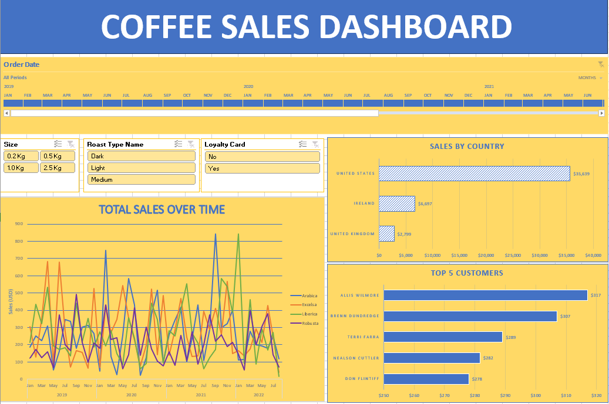

# Coffee-Shop-Project

# Table of contents

1. [Objective](#objective)
2. [Data Source](#data-source)
3. [Steps of the Project](#steps-of-the-project)
4. [Design](#design)
5. [Development](#development)
6. [Visualization](#visualization)

# Objective

- What is the main objective of this project ?

A coffee company wants to gain insights into their coffee bean sales over the past couple of years.

What is the decision making support ?

The best solution to support the owner of the coffee company is to create a dashboard that provides valuable insights into :

  - Total Sales
  - Top purchasing coutries
  - Clients loyalty
  - Product type
  - etc.

# Data Source

  The data is coming from an excel file sourced from Github. Url: [https://github.com/mochen862/excel-project-coffee-sales].

# Steps of the project

  - Design the dashboard
  - Developement (Explore data, Clean data and Validate data)
  - Testing
  - Vizualisation

# Design 

## Dashboard requirements
  - What are the dashboard requirements based on the information provided:

  - What are the total sales overtime?
  - Which countries have the most purchases of Coffee beans?
  - Who are the top 5 customers?

## Dashboard Mockup

  - Based on the information provided we need to create a dashboard with the following visuals:

|Visuals|
|---|
|Timeline Slicer|
|Line Chart|
|Horizontal bar chart|

## Tools

  Which tool will be used to complete this project?

| Tools | Purpose |
| --- | --- |
| Excel | To explore, clean, transform and present data |
| Github | To host and present the project documentation |

# Developement

## Pseudocode: Steps of the developement section

  - This are the main steps that will be followed in order to complete the project:

  1. Load data to Excel.
  2. Explore data
  3. Transform data
  4. Clean data
  5. Test data
  6. Build a Dashboard
  7. Visualize data
  8. Analysis and Recommendation

* All the steps are done in Excel

## Data Exploration
  - Excel will be used toclean data, transform and run quality checks.

  - This are the step to follow in order to clean the data properly for our project:

  1. Populate the columns that are empty of data.
  2. Format columns accordingly.
  3. Format null or empty data.
  4. Do a data duplicate check.
   
## Data Cleaning, Transfomration and Quality Check

  - Excel will be used to clean, transform and present the data.
  - By exploring the raw data we can observe the followings:
    1. Missing values in columns Customer Name, Email, Country, Coffee type, Roast Type, Size and Unit Price in the main table Orders.
    2. The date column need to be formated.
    3. Some values in the Email and Phone Number columns in the Customer table are null.
    4. Coffee type and Roast type are presented in their abbreviation form (Ex: L for Light or Ara for Arabica).
    5. Columns that represent price or monetary value aren't formatted in currency.
    6. The Size column in the Product table isn't formatted is mass unit

### Data Cleaning

- This are the step to follow in order to clean the data properly for our project:
    1. Populate the columns that are empty of data using XLOOKUP and INDEX/MATCH.
    2. Format the date column to yyyy-mmm-dd.
    3. Format column returning 0 as value using IF function.
    4. Do a duplicate check.

### XLOOKUP (Customer name, Email, Country)
```Excel
/*

--Populating columns that we need for the project

-- Customer Name
=XLOOKUP(C2,customers!$A$1:$A$1001,customers!$B$1:$B$1001,,0)

--Email
=IF(XLOOKUP(orders!C2,customers!$A$1:$A$1001,customers!$C$1:$C$1001,,0) = 0,"",XLOOKUP(orders!C2,customers!$A$1:$A$1001,customers!$C$1:$C$1001,,0))

--Country
=XLOOKUP(C2,customers!$A$1:$A$1001,customers!$G$1:$G$1001,,0)

-- Loyalty Card
=XLOOKUP([@[Customer ID]],customers!$A$2:$A$1001,customers!$I$2:$I$1001,,0)

```

### INDEX MATCH (Coffee Type, Roast Type, Size, Unit Price)

```Excel
/*

--Populating columns that we need for the project using INDEX/MATCH

-- Coffee Type, Roast Type, Size, Unit Price

=INDEX(products!$A$1:$G$49,MATCH(orders!$D2,products!$A$1:$A$49,0),MATCH(orders!I$1,products!$A$1:$G$1,0))


```

## Data Transformation

  - We will format selected columns
  - We will add 2 new columns with the full name of the coffee type and roast type.

### Formatting columns

| Column Name | Format type |
| --- | --- |
| Unit Price | Accounting number format (USD$) |
| Size | Custom in "Kg" |
	
### New Columns (Coffee Type Name, Roast Type Name)

```Excel
/*

-- Sales (Unit price * Quantity)

=L2*E2

-- Coffee Type Name

=IF(I2="Rob","Robusta",IF(I2="Exc","Excelsa",IF(I2="Ara","Arabica",IF(I2="Lib","Liberica",""))))

-- Roast Type Name

=IF(J2="M","Medium",IF(J2="L","Light",IF(J2="D","Dark","")))

```

## Testing and Quality Checks

  - We will proceed to do duplicate check using Excel Data tools > Remove duplicates

# Visualization

## Results 

 - This shows how the final dashboard looks like.




 
 
 	


    

